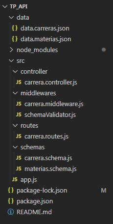

# Taller de Programación - TP 2024 - UNPAZ
# Grupo: RocketPeople
### Integrantes: 
- Barbara Carrizo
- Carlos Estevez
- Macarena Rivero
- Ivan Ezequiel Matallana


## API REST para Gestión de Carreras y Materias:

Este proyecto consiste en una API RESTful desarrollada con Express.js que permite gestionar carreras y materias en una universidad. La API proporciona operaciones CRUD (Crear, Leer, Actualizar, Borrar) para las carreras y materias, permitiendo a los usuarios realizar acciones como crear nuevas carreras, obtener información detallada de una carrera específica, eliminar una materia existente, etc.

## Endpoints de la API
### Carreras  
- GET /carreras - Obtener todas las carreras
  - Respuesta: 200 OK con un array de carreras
- GET /carreras/:id - Obtener una carrera por su ID
  - Respuesta: 200 OK con la carrera solicitada, 404 Not Found si no existe
- POST /carreras - Crear una nueva carrera
  - Respuesta: 201 Created con la carrera creada, 400 Bad Request si hay errores de validación en los parámetros (Parámetros requeridos: nombre, grado, universidad) 
- DELETE /carreras/:id - Borrar una carrera por su ID
  - Respuesta: 200 OK si se borra exitosamente, 404 Not Found si no existe
### Materias
- GET /materias - Obtener todas las materias
  - Respuesta: 200 OK con un array de materias
- GET /materias/:id - Obtener una materia por su ID
  - Respuesta: 200 OK con la materia solicitada, 404 Not Found si no existe
- POST /materias - Crear una nueva materia
  - Respuesta: 201 Created con la materia creada, 400 Bad Request si hay errores de validación en los parámetros (Parámetros requeridos: nombre, cuatrimestral, anio, carreraId)
- DELETE /materias/:id - Borrar una materia por su ID
  - Respuesta: 200 OK si se borra exitosamente, 404 Not Found si no existe

## Estructura de Archivos




## Instalación
### Requisitos Previos

- Node.js (v14 o superior)
- npm (v6 o superior)

### Pasos de Instalación

- Colocar el siguiente codigo en git y ejecutarlo e nla carpeta donde se desea clonar el repositorio:
```
git clone https://github.com/MatallanaIE/TP_API
```
- Abrir Visual Studio Code en la carpeta donde se clonó el repositorio

- Abrir la terminal en VSC e instalar las dependencias del proyecto, como resultado se agregará la carpeta "node_modules":
```
npm i express joi
npm i -D nodemon
```

- Iniciar el servidor con el siguiente comando:
```
npm run dev
```
Nota 1: El servidor estará corriendo en http://localhost:3000 por defecto

Nota 2: En el archivo "Carreras.postman_collection" se encontrará una colección que permitira probar las distintas funciones de la API

### Dependencias

- express - Framework de servidor web
- joi - Librería de validación nodemon - Herramienta de desarrollo para reiniciar el servidor automáticamente

## Contribuciones
Las contribuciones son bienvenidas. Por favor, abre un issue o un pull request para discutir cualquier cambio que te gustaría hacer.

